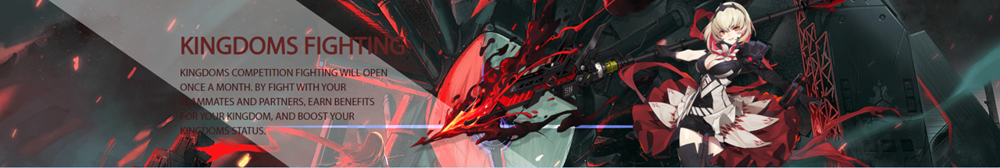

# 核心玩法——创新玩法

### 土地 & 国家 & 国战 & 公会战

<figure><figcaption>
土地系统
</figcaption></figure>

<mark style="color:orange;">**土地系统**</mark>：土地是极其珍惜的资源，玩家在Spirit Master中获得土地，土地能够产出丰富的物资。

<mark style="color:orange;">**普通土地**</mark>：SMR token奖励。

<mark style="color:orange;">**公会土地**</mark>：公会创建与招募权益，SMR token奖励。

<mark style="color:orange;">**国家土地**</mark>：代表阵营的最大规模战斗玩法，SMR token与其他物资收益丰富。

<figure><figcaption>
国家
</figcaption></figure>

通过与其他玩家合作或招募其他玩家，在游戏共同中建立一个统一的国家。

通过保卫国家或只是入侵其他国家来提升玩家在其国家的地位，<mark style="color:orange;">**（它会产出整个SMR总量的1%的奖励池基金）**</mark>。

阶级制度包括<mark style="color:orange;">**国王、大臣、普通官员和平民**</mark>，在每一场国战结束后，Spirit Master根据玩家的贡献和阶级等战斗点数来划分收益。

<figure><figcaption>
国战
</figcaption></figure>

如PVP所述，国战同样是充满竞技性的对抗模式，需要集齐国家内玩家的能力一同保对抗其他国家，玩家通过与的同阵营的队友并肩战斗，并提升自己在国家中的阶级地位，获取大量物资与SMR token收益，

游戏中期玩家将解锁国家玩法，玩家通过选择加入的国家而进行阵营划分，对立阵营的玩家将在每个月开启一次大型的国家土地争夺战，获胜方将获取特殊土地使用权一个月，直到下个月土地争夺战打响前交还给Spirit Master官方。

