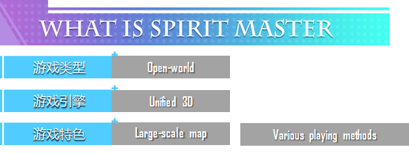
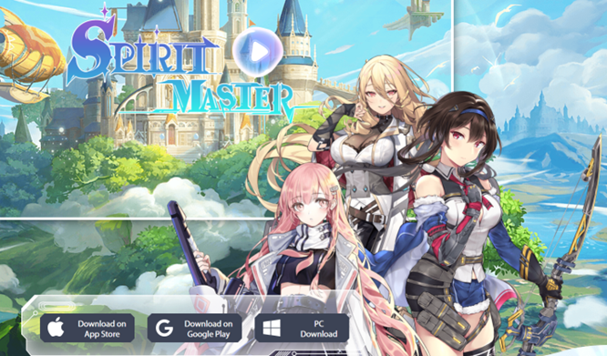

# 核心玩法——角色

<figure><figcaption>
游戏设定
</figcaption></figure>

### 角色 & 目标

玩家进入游戏后需创建属于自己的魂师角色，选择好性别和自己心仪的外形以及属性后，即可开始探索Spirit Marster的开放性世界。

在这里你可以跟着主线体验跌宕起伏、雄伟壮阔的剧情；也可以结实好友，创建自己的组织；当然你也可以随心所欲的感受Spirit Master世界的奇观，寻找散落在各地的奇珍异宝；击败魔物获取宝箱，获取顶级装备。

最终你将成为最出色的魂师，为自己的阵营、国家带来至高无上的荣耀。

<figure><figcaption>
游戏界面
</figcaption></figure>

### 人物属性

和主流MMORPG游戏一样，Spirit Marster的人物，怪物都有对应的属性，比如常见的有：

<mark style="color:blue;">·力量</mark>

<mark style="color:blue;">·敏捷</mark>

<mark style="color:blue;">·智力</mark>

<mark style="color:blue;">·体力</mark>

<mark style="color:blue;">·幸运</mark>

其影响对应角色的强度，Spirit Marster涉及属性的数值近上百种，给玩家的选择与搭配空间得到放大。
