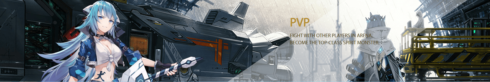

# 核心玩法——PVP

### PVP

<mark style="color:blue;">PVP是Spirit Master的对战以及竞技属性玩法，同时也是获得SMR token的最佳途径。</mark>

目前PVP有两种模式：<mark style="color:blue;">1v1天梯竞技；4v4天梯竞技</mark>，前者需要玩家具备较高的竞技水平、较高的操作水平和技能装备搭配策略；后者要求玩家与队友之间的相互配合以及技能搭配等考核团队间的默契程度。

PVP的基本规则为同一战力区间的玩家进行匹配，以公平为基础，进行限时对战，获胜者将得到天梯积分，天梯排名的不同区间将对应不同的奖励（<mark style="color:blue;">根据1V1 4V4，拥有两个天梯排行榜）</mark>。

Spirit Master根据不同的结算周期，对应发放游戏内物资、道具、NFT碎片、装备等不同奖励，以及SMR token。

<figure><figcaption>
PVP
</figcaption></figure>

### 战场

8V8战场是4V4战场的放大版，区别组队规则加入的非对称式自由组队，带来了更多的随机性和突发事件，加倍的的火力，加倍的紧张刺激

80人战场能拓展衍生出各类玩法，Spirit Master将不断为玩家呈现更宏伟的战斗：

<mark style="color:blue;">·吃鸡模式</mark>

<mark style="color:blue;">·资源点争夺</mark>

<mark style="color:blue;">·击杀次数</mark>

<mark style="color:blue;">·守护模式</mark>
