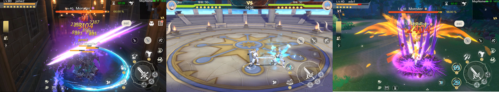

# 核心玩法——游戏设定

### 任务 & 活动

<figure><figcaption>
页面展示
</figcaption></figure>

Spirit Master的主线剧情内容长达8个章节，其中包含了大量的主线任务，完成主线任务不仅能够推动游戏剧情的发展，也可以为获得大量的角色经验和不错的装备道具，使玩家角色得到一定的成长，完成主线任务是了解并熟悉Spirit Master游戏世界的最好方式，和体验游戏内容的最好方式。

游戏中的数百个支线任务，是丰富游戏内各个NPC剧情，和故事完整性的非必要任务，完成支线任务同样也能获得不错的装备、道具和游戏内货币收益。

除此之外，Spirit Master还为玩家们准备了大大小小的活动，包括日常活动、节日活动、限时活动以及一些第三方举办的活动，如果你积极参与活动，就能够提升角色的强度和游戏账号内的物资。

<mark style="color:blue;">还有更多游戏世界内的奇遇等待玩家们挖掘，请尽情的探索分享Spirit Master游戏世界中的奇闻异事。</mark>

### 敌人 & 怪物

Spirit Master内玩家的敌人一般分为：<mark style="color:blue;">人型敌人、妖怪、动物型怪物、异化生物、神魔类怪物；同时可细分为数十种种族，</mark>未来随着Spirit Master的不断更新，怪物种类和数量也将不断的增加。
