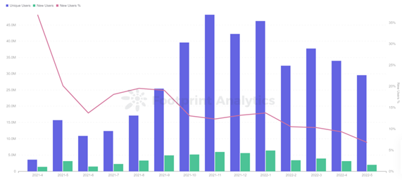

# 各市场分析

**Web3.0 & Crypto市场**

根据Crypto.com的最新报告，2022 年底前加密货币用户将达到10 亿

根据Cointelegraph报告数据，截至2021年6月，全球加密货币用户数已达到2.21亿，其中从6500万用户增长到1亿用户花费了九个月的时间，而从1亿用户增加到2亿用户仅花费了四个月的时间。

**GameFi市场**

根据区块链数据分析网站 Footprint 发布5月份GameFi市场分析报告，GameFi活跃总用户数为 1983 万人，其中新用户有 83 万人，老用户为 1900 万人。

<figure><figcaption>
GameFi市场用户数量——2022.5近30M
</figcaption></figure>

 

<figure><figcaption>
GameFi市场整体交易量——2022.5近250M
</figcaption></figure>

**机会&破局**

我们（Spirit Master）认为Web3.0、Crypto、GameFi拥有巨大潜力，是游戏行业市值的加速器，并且判断GameFi将在未来游戏领域承担重要角色，和游戏全球化的重要指标。

通过全球游戏市场与GameFi市场的规模与扩展性进行分析，GameFi领域充满尝试机会，GameFi领域蓬勃发展已成必然趋势。

GameFi赛道经历过爆发阶段，将回归价值本身：游戏的高可玩性&活跃的游戏用户，使得Gamefi拥有长线生命周期，可延长至2年以上，Spirit Master符合上述特征,孕育而生**。**
