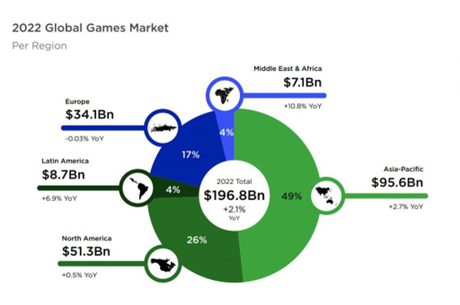

# 全球游戏市场——传统游戏

根据市场调研公司Newzoo最近发布的2022全球游戏市场报告显示，今年全球游戏市场规模预计1968亿美元，同比增幅2.1%

游戏市场依旧焕发活力，2022年游戏市场规模增幅速度减缓，2025年预计全球玩家将从目前的32亿增至35亿人，预计到2025年，游戏市场规模将达到2257亿美元。

<figure><figcaption>
传统游戏数据1
</figcaption></figure>

 

<figure><figcaption>
传统游戏数据2
</figcaption></figure>

**全球游戏市场区域分布**

游戏用户分布情况：亚洲地区占比49%拥有最大的用户量级，值得关注的是，独联体地区、中东、印巴、东欧地区以及部分非洲地区游戏用户都有所增长。这与区块链用户增长和发展方向趋同，无疑对GameFi项目而言是个利好消息。

<figure><figcaption>
市场分布
</figcaption></figure>
