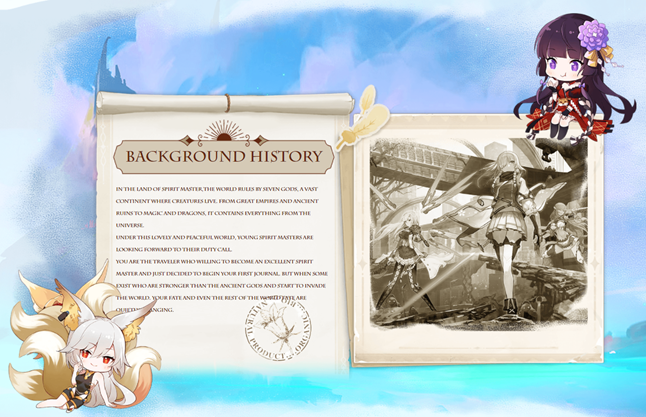

# 世界观 & 大背景

七位神明掌管着Spirit Master世界，这是一片生灵栖息的广阔大陆，伟大的帝国、古代遗迹、深邃的海洋、无垠的天空之城...光明与黑暗魔法，远古的巨龙，Spirit Master包含了来自宇宙的万物。

在这包容与祥和的世界中，暗流涌动，而年轻的魂师们将迎来属于自己的不同使命，神明即将召唤他们，你就是其中之一，优秀的魂师，当上古神灵和异界魔物入侵世界时，你和整个世界的命运都在悄然改变！

<figure><figcaption>
展示
</figcaption></figure>

### <mark style="color:blue;">Spirit Master世界由7个国家阵营组成，将呈现8个章节的丰富主线故事</mark>

<mark style="color:blue;">**至高神的轮回**</mark>

“作为拥有绝对力量和绝对权威的神明，当这个世界诞生之初，至高神便存在于此。司长一切的祂呵护着无数个世界，祂兢兢业业地守护着每一个世界，也见证了无数世界的新生与消亡。

渐渐地，一个想法出现在了至高神的脑海——如果人会死，文明会迎来终结，星球亦会随着时间而毁灭，那么自己是否也有终结的那一天？

<mark style="color:blue;">**至高神对死亡感到恐惧**</mark>

但祂是至高神，祂无所不能。于是，祂只做了一个强壮得足以容纳祂灵魂与力量的肉体，然后通过转移自己的灵魂，得以永生。

在经过无数次转生后，至高神在不同的留意到了这样一个元素能量充沛的世界，以至高神的经验来看，这里拥有足够的条件来培育祂的下一个容器。”

<mark style="color:blue;">**七神国度**</mark>

“这个世界上活跃着七位神明和他们的眷属。七神曾经经历过了漫长的战斗，最终各居一处，相互平衡。

这几位神明性格迥异，能力不同。但唯有一点是共通的——祂们愿意接纳凡人的供奉，带领凡人生存于这片大陆上。”
